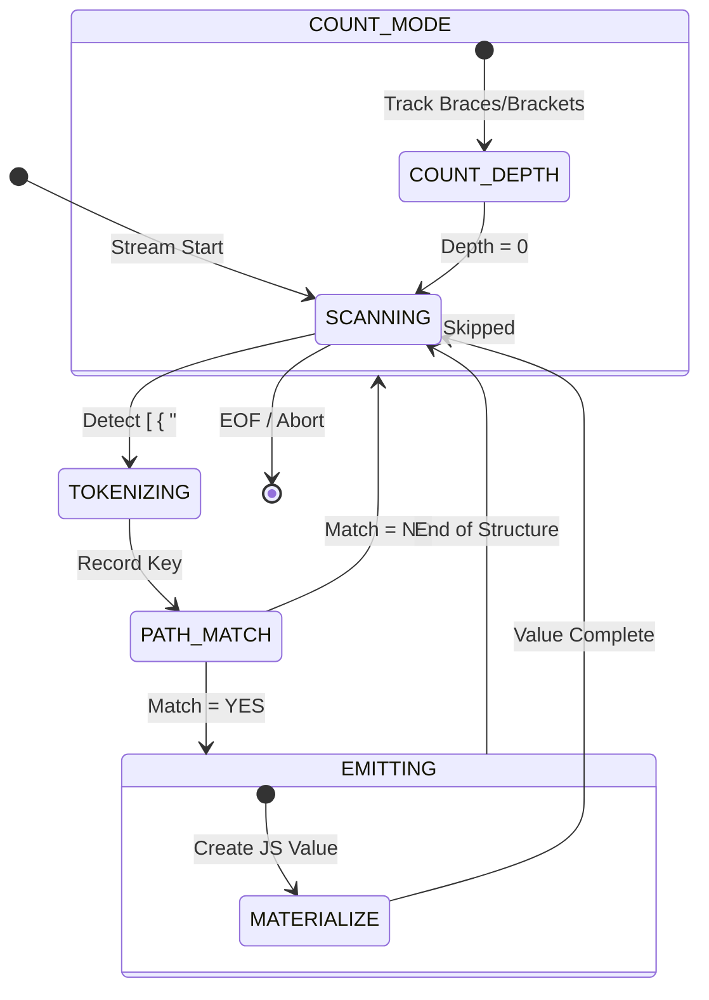

# JQL V2 Technical Specification

## 1. FSM State Diagram (Parser + Skipper)

Below is the conceptual flow for the JQL V2 engine. The transition logic ensures that when a path is not matched, the engine falls back to a high-speed "Counting" state.

## 2. Capability Matrix

| Feature | Streaming Mode (Single-Pass) | Indexed Mode (Multi-Query) |
| :--- | :--- | :--- |
| **Random Access** | ❌ Not Supported | ✅ Supported via Root Index |
| **Backtracking** | ❌ Not Supported | ⚠️ Limited (Root-hop only) |
| **Deep Query** | ✅ Supported | ✅ Supported |
| **Directives** | ✅ Emit-time only | ✅ Full Support |
| **Memory Cost** | $O(1)$ JSON Depth | $O(1) +$ Index Size |

## 3. Directive Registry Spec (V1)

Directives are strictly **Pipeable Creators**. They receive the raw data before it hits the final result object.

| Directive | Purpose | Input Type |
| :--- | :--- | :--- |
| `@alias(to: "name")` | Rename key | Any |
| `@coerce(to: "number"\|"string")` | Type casting | Any |
| `@default(value: any)` | Fallback if null | Any |
| `@formatNumber(dec: 2)` | Decimal fixing | Number |
| `@substring(start: N, len: M)` | String slicing | String |

### Guardrails

1. No two-pass directives (e.g., `@sum` of siblings is forbidden).
2. Directives cannot modify the stream state or depth counter.
