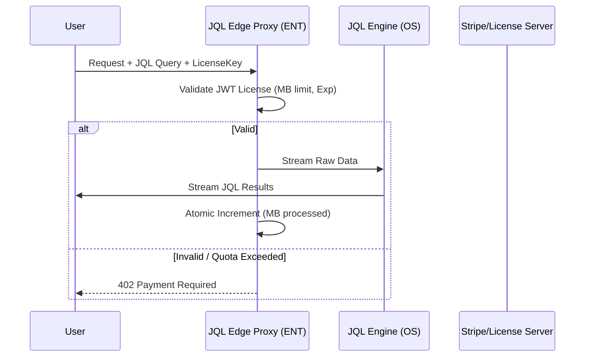

# JQL Monorepo & Monetization Strategy

## 🏗️ Repository Architecture

To balance Open Source (OS) growth with Enterprise (ENT) monetization, we will split the codebase into two distinct repositories or a tightly controlled Monorepo with a private `packages/enterprise` scope.

### 1. `jql-core` (Public OS)

- **Repo**: `laphilosophia/jql`
- **License**: MIT
- **Contents**:
  - `@jql/core`: FSM Tokenizer/Engine.
  - `@jql/runtime`: Standard Pull/Push runtimes.
  - `@jql/cli`: The terminal tool.
  - `@jql/adapters`: Basic Node.js/Fetch adapters.

### 2. `jql-enterprise` (Private Commercial)

- **Repo**: `laphilosophia/jql-ent` (or private workspace)
- **License**: Proprietary / Commercial
- **Contents**:
  - `@jql/edge-cloudflare`: Advanced Cloudflare Workers adapter with Durable Objects storage for metrics.
  - `@jql/edge-vercel`: Vercel Edge Middleware adapter.
  - `@jql/edge-fastly`: Compute@Edge WASM-wrapped adapter.
  - `@jql/license-proxy`: Signed JWT validation & Quota enforcement.

---

## 📡 Edge Proxy Architecture (The Monetization Layer)

The Edge Adapters inside the Enterprise repo will act as a **Pre-Execution Shield**.

### Technical Implementation

- **Zero Overhead**: The License check happens in the `start()` hook of the stream.
- **WASM Obfuscation**: Large enterprise adapters can be compiled to WASM via AssemblyScript/Rust to prevent license-check tampering in the JS bundle.
- **Quota Hooks**: Using Cloudflare KV or Durable Objects to track real-time usage across the edge.

---

## 💰 Next Steps for Monetization

1. **GitHub Organization**: Move JQL to a professional Org.
2. **Private Repo Setup**: Initialize `jql-ent`.
3. **License Authority**: Build the signed JWT issuer (Lambda/Worker).
4. **Stripe Integration**: Link license keys to active subscriptions.
